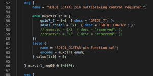
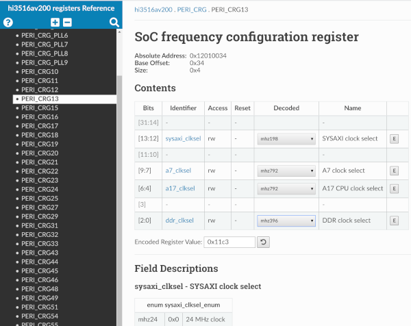

<p align="center">
 
</p>

<h3 align="center">registers-description</h3>

---

<p align="center">HiSilicon ip camera SoCs SystemRDL registers description</p>
<p align="center"><em>Part of <a href="https://www.openhisiipcam.org">OpenHisiIpCam</a> project</em></p>

## :eyeglasses: About

This is attempt to describe SoCs registers in SystemRDL notation. 
Unfortunately, vendor provides registers information only in as part of big pdf document.

**There is no target to describe all registers, as it will take abnormal amount of time, also it is not needed. 
We describe only needed subsets, that are envolved in our tasks.**

Generated documentation is avalible on [our website](https://www.openhisiipcam.org/hardware/registers-description/).

> If some hardware engineer from HiSilicon will ever read this text, please take a note
> that it will be great if you will put registers description to SDK in some machine readable format.
> Obviously you already have it and generate parts of documentation from it. 
> This will let us avoid a lot of tedious work!

> *The SystemRDL language, supported by the SPIRIT Consortium, was specifically designed to describe and implement a wide variety of control status registers. 
> Using SystemRDL, developers can automatically generate and synchronize register views for specification, hardware design, software development, verification, and documentation.*
> - from [Wikipedia](https://en.wikipedia.org/wiki/SystemRDL).

## :hammer: Usage

Assumed that you have python3 and pip3 already installed.

```console
foo@bar:~/registers-description$ make deps
foo@bar:~/registers-description$ make 
```

This will produce hi3516av200.rdl (overall data for hi3516av200 and hi3519v101) 
and output dir with html auto documentation (example screenshot below).



Take a note, that overall data splitted into several files:

```shell
./hi3516av200
├── Makefile		# 
├── hi3516av200.rdl	# addrmap for hi3516av200
├── hi3519v101.rdl	# addrmap for hi3519v101
├── mddrc_ddr_phy.rdl	# r
├── misc_ctrl.rdl	# e 
├── mux.rdl		# g
├── pad_ctrl.rdl	# f
├── peri_crg.rdl	# i
├── peri_pmc.rdl	# l
├── sc_3516av200.rdl	# e
└── sc_3519v101.rdl	# s
```

Files alone are not valid SystemRDL data, files should be assembled (simply concatenated, that `./hi3516av200/Makefile` do) in complete valid document.

## :pencil: Notes

Initially there was idea to parse register initilization data from HiSilicon`s U-Boot to learn it in human readable way. 
> There is also [good research](https://github.com/kakigate/hisi-initregtable-parser) about hisi`s initial registers table.

After an attempt to invent ~bicycle~ custom register description format, we choosed SystemRDL, 
as notation with already implemented compiler, verification and even HTML docs generator.

> Great set of [python tools and libs for SystemRDL](https://github.com/SystemRDL) by @amykyta3,
> really makes it easy to process SystemRDL data.

Example of reg_bin parsed data, using SystemRDL registers description:
```
reg        value      delay      attrs
0x12010034 0x00000000 0x00000000 0x00000015	WRITE	PERI_CRG13[0:2] (SoC frequency configuration register)
							field ddr_clksel[0:2] (DDR clock select) val = 0x0 (mhz24)
0x12010034 0x00000000 0x00000000 0x00002015	WRITE	PERI_CRG13[4:6] (SoC frequency configuration register)
							field a17_clksel[4:6] (A17 CPU clock select) val = 0x0 (mhz24)
0x12010034 0x00000000 0x00000000 0x00003815	WRITE	PERI_CRG13[7:9] (SoC frequency configuration register)
							field a7_clksel[7:9] (A7 clock select) val = 0x0 (mhz24)
0x12010034 0x00000000 0x00000000 0x0000600D	WRITE	PERI_CRG13[12:13] (SoC frequency configuration register)
							field sysaxi_clksel[12:13] (SYSAXI clock select) val = 0x0 (mhz24)
0x1201013C 0x00000000 0x00000000 0x004D0000	READ	PERI_CRG79[0:9] (SoC frequency status register)
							field a7_sc_seled[0:2] (A7 clock switching completion indicator) val = 0x0 (mhz24)
							field a17_sc_seled[3:5] (A17 clock switching completion indicator) val = 0x0 (mhz24)
							field ddr_sc_seled[6:8] (DDR clock switching completion indicator) val = 0x0 (mhz24)
							field sysaxi_sc_seled[9:9] (SYSAXI clock switching completion indicator) val = 0x0 (mhz24)
0x12010000 0x00000000 0x00000064 0x00000000	DELAY   100
0x12010004 0x0B1183A2 0x00000000 0x000000FD	WRITE	PERI_CRG_PLL1[0:31] (APLL configuration register 1)
							field apll_fbdiv[0:11] (Integral part of the APLL frequency multiplication coefficient) val = 0x3A2
							field apll_refdiv[12:17] (Frequency divider of the APLL reference clock) val = 0x18
							field apll_fout4phasepd[20:20] (APLL FOUT output power-down control) val = 0x1 (no)
							field apll_postdivpd[21:21] (APLL FOUT output power-down control) val = 0x0 (normal)
...
```

Later we recognized that SystemRDL is also useful for meta code generation. 
Noted before [systemrdl-compiler](https://github.com/SystemRDL/systemrdl-compiler) can be used as base tool for parsing.

Sample code (golang) before:
```go
utils.WriteDevMem32(0x20270110, 0x60FA0000)
var tempCode uint32 = utils.ReadDevMem32(0x20270114)
```

Sample code after:
```go
regs.Addr(PERI_CRG79).Field("a7_sc_seled").Set("mhz24")
regs.Addr(SOME_TEMPERATURE).Read()
```
In case of massive register manipulation code, it makes less mental effort.

## :pray: Contribution

At the moment there is only hi3516av200 family chips data, if you feel this is useful for you, you can help us improve data, we accept contribution for other chips via PRs.
